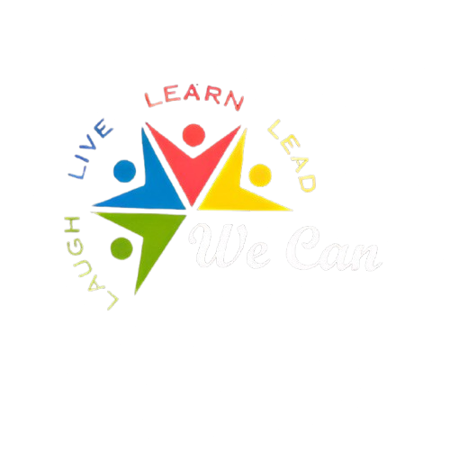

# WeCan - Social Welfare Club Website

<div align="center">
  
  <p><strong>Learn. Lead. Laugh.</strong></p>
</div>

A comprehensive, responsive website for WeCan, a social welfare club of NIT Agartala, dedicated to empowering underprivileged children through education, mentorship, and skill development programs.

[](https://nextjs.org/)
[](https://reactjs.org/)
[](https://tailwindcss.com/)
[](https://www.mongodb.com/)
[](https://opensource.org/licenses/MIT)

## 📑 Table of Contents

- [Features](#-features)
- [Tech Stack](#%EF%B8%8F-tech-stack)
- [Getting Started](#-getting-started)
- [Project Structure](#-project-structure)
- [Key Pages](#-key-pages)
- [API Endpoints](#-api-endpoints)
- [Authentication](#-authentication)
- [Database Models](#-database-models)
- [Mobile App Integration](#-mobile-app-integration)
- [Deployment](#-deployment)
- [Contributing](#-contributing)
- [License](#-license)
- [Contact](#-contact)

## 🌟 Features

- **Responsive Design**: Fully responsive website optimized for all devices (mobile, tablet, desktop)
- **Modern UI/UX**: Intuitive user interface with smooth animations using Framer Motion
- **Authentication System**:
  - Secure user authentication with NextAuth.js
  - Role-based access control (user, volunteer, admin, alumni)
  - Protected routes for authenticated users
- **Alumni Network**:
  - Alumni registration and verification process
  - Alumni profile management
  - Alumni directory and networking features
  - Admin approval workflow for alumni registration
- **Volunteer Management**:
  - Information about past and present volunteers by year
  - Volunteer registration system with admin approval
  - Volunteer profiles with skills, department, and social links
  - Volunteer application tracking system
- **Ananya Festival**:
  - Comprehensive information about the annual sports-cultural festival
  - Year-wise gallery of past events
  - Registration system for upcoming events
  - Testimonials from participants and organizers
- **Donation System**:
  - Multiple donation options with QR code and bank details
  - Impact stories featuring real WeCan students with photos
  - Expandable 'Read More' sections for each story
- **Admin Dashboard**:
  - Comprehensive admin interface for site management
  - Approval workflows for volunteer and alumni applications
  - Content management capabilities
  - Analytics and reporting
- **Contact System**:
  - Interactive contact form with validation
  - Email notification system for inquiries
  - FAQ section for common questions
- **Accessibility**: Designed with accessibility in mind following best practices

## 🛠️ Tech Stack

### Frontend
- **Framework**: React.js 18.2.0 with Next.js 14.1.0 (App Router)
- **Styling**: Tailwind CSS 3.4.1 with custom configuration
- **Animations**: Framer Motion 11.0.3
- **Forms**: React Hook Form 7.49.3 with Zod 3.22.4 for validation
- **UI Components**:
  - React Icons 5.0.1 for iconography
  - Swiper 11.0.5 for image carousels and sliders
- **State Management**: React Context API with custom hooks
- **Notifications**: React Toastify 10.0.4

### Backend
- **Framework**: Next.js API Routes (App Router)
- **Database**:
  - MongoDB 6.14.2 with Mongoose 8.14.0 ODM
  - Prisma 6.6.0 as ORM
- **Authentication**:
  - NextAuth.js 4.24.5
  - JSON Web Tokens (JWT) 9.0.2
  - bcryptjs for password hashing
- **Email**: Nodemailer 6.10.1 for transactional emails
- **Storage**: Cloudinary 2.6.0 for image uploads and management

### DevOps & Tools
- **Version Control**: Git and GitHub
- **Package Manager**: npm/yarn
- **Deployment**: Vercel (optimized for Next.js)
- **Environment Variables**: dotenv 16.4.5
- **Code Quality**: ESLint and Prettier

## 🚀 Getting Started

### Prerequisites

- Node.js (v18.x or later)
- npm (v9.x or later) or yarn
- MongoDB (local instance or MongoDB Atlas account)
- Git

### Installation

1. **Clone the repository**:
   ```bash
   git clone https://github.com/WeCanNita25/WeCan-Backend.git
   cd WeCan-Backend
   ```

2. **Install dependencies**:
   ```bash
   npm install
   # or
   yarn install
   ```

3. **Environment Setup**:
   
   Create a `.env.local` file in the root directory with the following variables:
   ```env
   # MongoDB Connection
   MONGODB_URI=your_mongodb_connection_string
   
   # NextAuth Configuration
   NEXTAUTH_SECRET=your_secure_nextauth_secret
   NEXTAUTH_URL=http://localhost:3000
   
   # Cloudinary (for image uploads)
   CLOUDINARY_CLOUD_NAME=your_cloudinary_cloud_name
   CLOUDINARY_API_KEY=your_cloudinary_api_key
   CLOUDINARY_API_SECRET=your_cloudinary_api_secret
   
   # Email (for contact form and notifications)
   EMAIL_SERVER_USER=your_email@example.com
   EMAIL_SERVER_PASSWORD=your_email_password
   EMAIL_SERVER_HOST=smtp.example.com
   EMAIL_SERVER_PORT=587
   EMAIL_FROM=noreply@wecan.org
   
   # Admin User Creation (optional)
   ADMIN_EMAIL=admin@example.com
   ADMIN_PASSWORD=secure_password
   ```

4. **Initialize Database**:
   ```bash
   # If using Prisma
   npx prisma generate
   npx prisma db push
   
   # Optional: Create admin user
   npm run create-admin
   ```

5. **Run the development server**:
   ```bash
   npm run dev
   # or
   yarn dev
   ```

6. **Open [http://localhost:3000](http://localhost:3000)** in your browser to see the website.

### Scripts

- `npm run dev` - Start development server
- `npm run build` - Build the application for production
- `npm run start` - Start the production server
- `npm run lint` - Run ESLint to catch errors
- `npm run seed-admin` - Seed an admin user in the database
- `npm run test-db` - Test database connection
- `npm run test-db-all` - Test multiple database connections
- `npm run test-db-direct` - Test direct MongoDB connection

## 📁 Project Structure

```
wecan-website/
├── public/                  # Static files
│   ├── logo.png             # Logo files
│   └── images/              # Image assets for the website
├── src/                     # Source code
│   ├── app/                 # Next.js App Router
│   │   ├── api/             # API routes for server-side functionality
│   │   │   ├── admin/       # Admin-related API endpoints
│   │   │   ├── alumni/      # Alumni registration and management
│   │   │   ├── ananya/      # Ananya festival registration
│   │   │   ├── auth/        # Authentication endpoints
│   │   │   ├── contact/     # Contact form handling
│   │   │   ├── donate/      # Donation processing
│   │   │   └── volunteers/  # Volunteer registration and management
│   │   ├── about/           # About page with history and mission
│   │   ├── admin/           # Admin dashboard and management
│   │   ├── alumni/          # Alumni pages and registration
│   │   ├── ananya/          # Ananya festival pages
│   │   ├── contact/         # Contact page
│   │   ├── developers/      # Developer credits and contribution info
│   │   ├── donate/          # Donation page with impact stories
│   │   ├── login/           # Authentication pages
│   │   ├── profile/         # User profile management
│   │   ├── register/        # Registration pages
│   │   ├── volunteers/      # Volunteer information and registration
│   │   ├── globals.css      # Global styles
│   │   ├── layout.tsx       # Root layout component
│   │   └── page.tsx         # Home page component
│   ├── components/          # Reusable React components
│   │   ├── AppPromotion.tsx # Mobile app promotion component
│   │   ├── Donate.tsx       # Donation component
│   │   ├── Footer.tsx       # Site footer component
│   │   ├── Gallery.tsx      # Image gallery component
│   │   ├── Hero.tsx         # Hero section component
│   │   ├── ImageCarousel.tsx # Image carousel component
│   │   ├── Mission.tsx      # Mission statement component
│   │   └── Navbar.tsx       # Navigation bar component
│   ├── lib/                 # Utility functions and libraries
│   │   ├── auth.ts          # Authentication utilities
│   │   ├── db.ts            # Database connection utilities
│   │   ├── mongodb.ts       # MongoDB configuration
│   │   └── prisma.ts        # Prisma client configuration
│   ├── models/              # Mongoose data models
│   │   ├── Alumni.ts        # Alumni data model
│   │   ├── Comment.ts       # Comment data model
│   │   ├── Event.ts         # Event data model
│   │   └── Team.ts          # Team/Volunteer data model
│   ├── providers/           # React context providers
│   │   └── SessionProvider.tsx # Auth session provider
│   ├── types/               # TypeScript type definitions
│   └── utils/               # Helper functions and utilities
├── .env.local               # Environment variables (not in repository)
├── .gitignore               # Git ignore file
├── LICENSE                  # MIT license file
├── next.config.js           # Next.js configuration
├── package.json             # Project dependencies
├── postcss.config.js        # PostCSS configuration
├── prisma/                  # Prisma ORM
│   └── schema.prisma        # Database schema
├── README.md                # Project documentation
├── tailwind.config.js       # Tailwind CSS configuration
├── tsconfig.json            # TypeScript configuration
└── vercel.json              # Vercel deployment configuration
```

## 🖥️ Key Pages

### Home Page
- Hero section with mission statement and call-to-action
- Featured programs and impact statistics
- Image gallery showcasing activities
- Mobile app promotion
- Testimonials from beneficiaries and volunteers

### About Page
- History of WeCan since 2013
- Mission and vision statements
- Timeline of milestones and achievements
- Messages from key stakeholders:
  - Director of NIT Agartala
  - Dean of Student Welfare
  - Faculty Coordinator
  - Current President

### Ananya Festival Page
- Overview of annual cultural-sports festival
- Year-wise event history and highlights
- Image galleries for previous events
- Registration form for upcoming events
- Testimonials from participants and organizers

### Volunteers Page
- Current volunteer team structure and roles
- Past volunteers organized by year
- Volunteer registration process
- Benefits of volunteering

### Donate Page
- Multiple donation options (QR code, bank details)
- Real impact stories of WeCan beneficiaries
- How donations are used
- Transparency in fund allocation

### Developers Page
- Credits to website development team
- Technology stack overview
- Contribution guidelines
- Links to GitHub repositories

## 🔌 API Endpoints

The website includes the following key API endpoints:

### Authentication
- `/api/auth/[...nextauth]` - NextAuth.js authentication routes
- `/api/auth/register` - User registration
- `/api/auth/reset-password` - Password reset functionality

### Alumni
- `/api/alumni` - Alumni registration and retrieval
- `/api/alumni/:id` - Individual alumni management
- `/api/alumni/approve` - Admin approval for alumni applications

### Ananya Festival
- `/api/ananya/register` - Event registration
- `/api/ananya/participants` - Participant management

### Volunteer Management
- `/api/volunteers/register` - Volunteer registration
- `/api/volunteers/approve` - Admin approval for volunteer applications

### Contact and Feedback
- `/api/contact` - Contact form submission
- `/api/feedback` - User feedback collection

### Admin Functions
- `/api/admin/users` - User management
- `/api/admin/content` - Content management
- `/api/admin/events` - Event management

## 🔒 Authentication

The website uses NextAuth.js for authentication with the following features:

- **Session Management**:
  - JWT-based sessions
  - Secure, HTTP-only cookies
  - Customizable session duration

- **Authentication Methods**:
  - Email/password authentication
  - (Optional) OAuth providers can be added

- **Security Features**:
  - CSRF protection
  - Secure password hashing with bcrypt
  - Rate limiting for login attempts

- **Role-Based Access**:
  - User roles: user, volunteer, alumni, admin
  - Protected routes based on user role
  - Permission-based actions

- **Custom Auth Flow**:
  - Email verification
  - Password reset functionality
  - Account lockout after failed attempts

## 📊 Database Models

### User Model
- Basic authentication information
- Profile details
- Role and permissions

### Alumni Model
- Graduation details
- Professional information
- Connection to user account
- Approval status

### Volunteer Model
- Personal information
- Skills and availability
- Department and position
- Active status

### Ananya Registration Model
- Participant information
- Event preferences
- Registration status

### Event/Activity Model
- Event details and schedule
- Participation information
- Image galleries

### Donation Model
- Donation information
- Donor details (if provided)
- Transaction status

## 📱 Mobile App Integration

The WeCan ecosystem includes a mobile application that complements the website:

- **App Features**:
  - Quick access to WeCan information
  - Event notifications and updates
  - Volunteer coordination
  - Donation capabilities

- **Download Links**:
  - [Android App](https://play.google.com/store/apps/details?id=com.nita.wecan)
  - iOS App (Coming Soon)

- **App-Website Sync**:
  - Shared authentication system
  - Consistent user experience
  - Real-time updates across platforms

## 🚀 Deployment

This project is configured for deployment on Vercel, which provides optimal support for Next.js applications.

### Deployment Steps

1. **Create a Vercel Account**:
   - Sign up at [vercel.com](https://vercel.com)
   - Connect your GitHub account

2. **Import the Repository**:
   - Select the WeCan-Backend repository
   - Configure the project settings

3. **Environment Variables**:
   - Add all required environment variables in the Vercel dashboard
   - Ensure database connection strings are properly configured

4. **Deploy**:
   - Vercel will automatically build and deploy your application
   - Each push to the main branch will trigger a new deployment

### Alternative Deployment Options

- **Traditional Hosting**:
  ```bash
  npm run build
  npm run start
  ```

- **Docker Deployment**:
  - A Dockerfile is included for containerized deployment
  - Deploy to any container orchestration service

## 🤝 Contributing

We welcome contributions to improve the WeCan website! Here's how to contribute:

1. **Fork the Repository**:
   - Create your own fork of the project
   - Clone your fork locally

2. **Create a Branch**:
   - Create a branch for your feature or bugfix
   - Use a descriptive name (e.g., `feature/alumni-search` or `fix/contact-form`)

3. **Make Changes**:
   - Implement your changes
   - Follow the existing code style
   - Add or update tests as necessary
   - Update documentation if needed

4. **Testing**:
   - Ensure all tests pass
   - Test your changes thoroughly

5. **Create a Pull Request**:
   - Submit a PR to the main repository
   - Provide a clear description of the changes
   - Reference any related issues

### Code Style Guidelines

- Follow the established project code style
- Use TypeScript for type safety
- Write meaningful commit messages
- Include comments for complex logic

### Reporting Bugs

- Use the GitHub issues tracker
- Provide detailed steps to reproduce the bug
- Include browser/environment information

## 📄 License

This project is licensed under the MIT License - see the [LICENSE](LICENSE) file for details.

## 📞 Contact

For any questions, suggestions, or collaboration opportunities:

- **Email**: wecan.nitagartala@gmail.com or developer.wecan.nita@gmail.com
- **Social Media**:
  - [LinkedIn](https://www.linkedin.com/company/wecan-nita)
  - [Instagram](https://www.instagram.com/wecan_nita)
- **Address**: SAC Building-NIT Agartala, Jirania, Tripura (West), Tripura, 799046
- **Phone**: +91 75619 73554

---

<div align="center">
  <p>Built with ❤️ by <a href="/developers">WeCan Development Team</a></p>
  <p>© 2025 WeCan - NIT Agartala</p>
</div>

